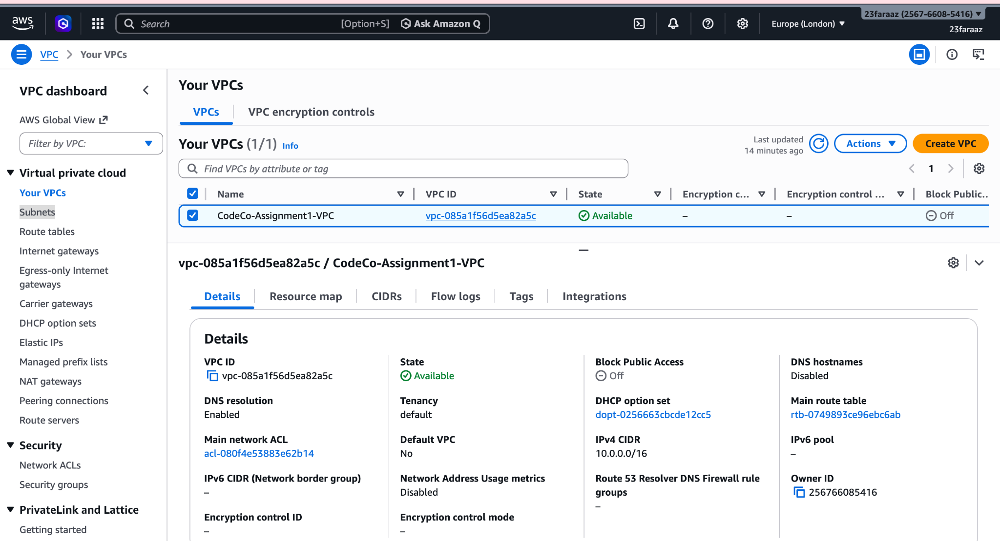
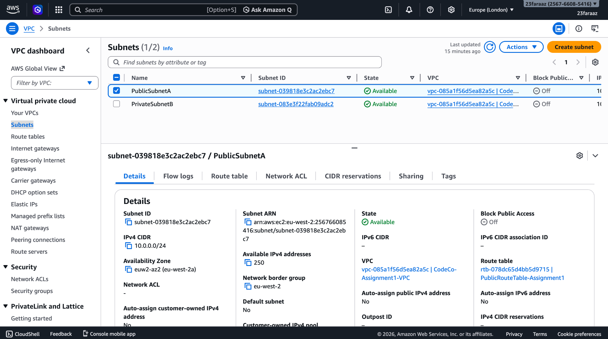
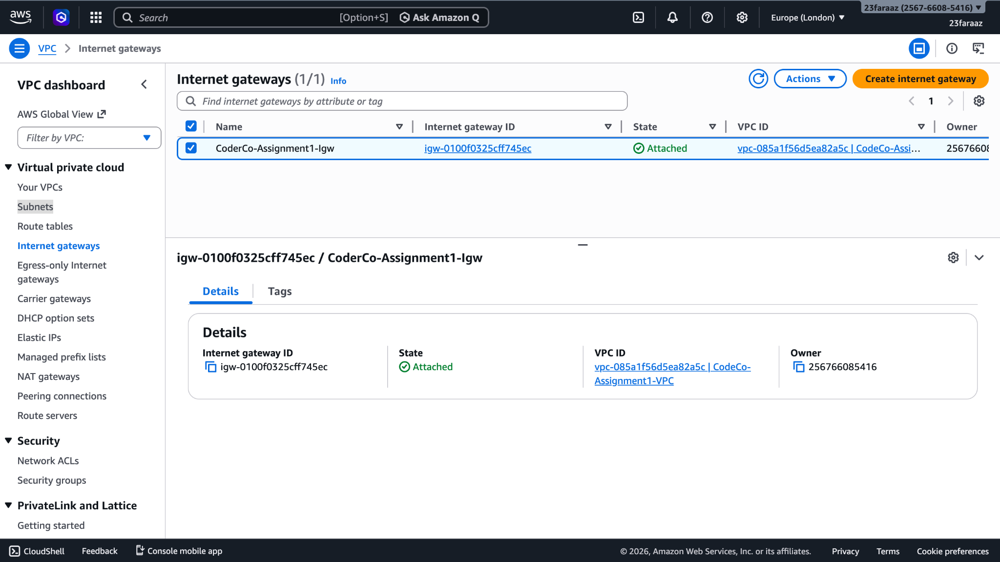
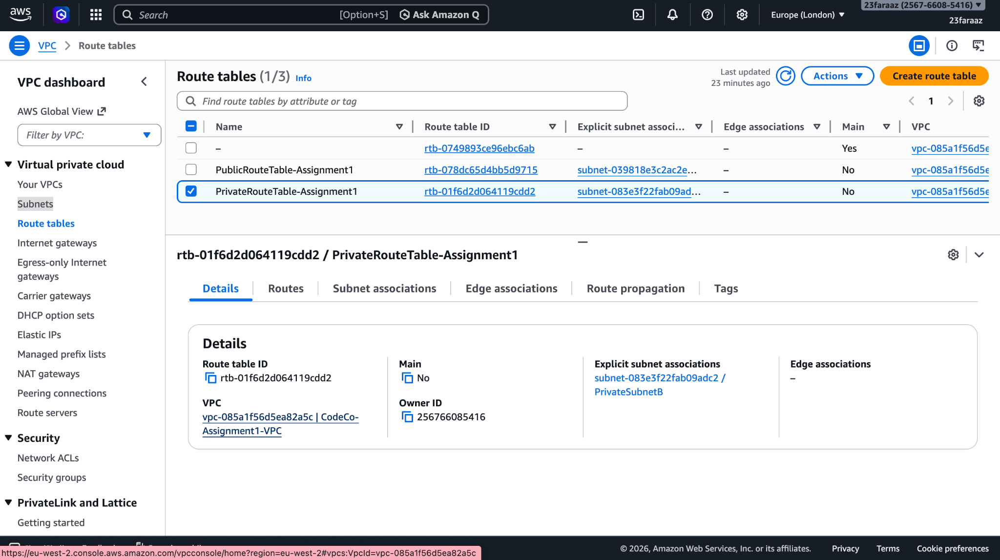
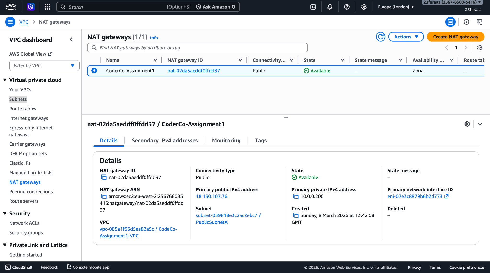
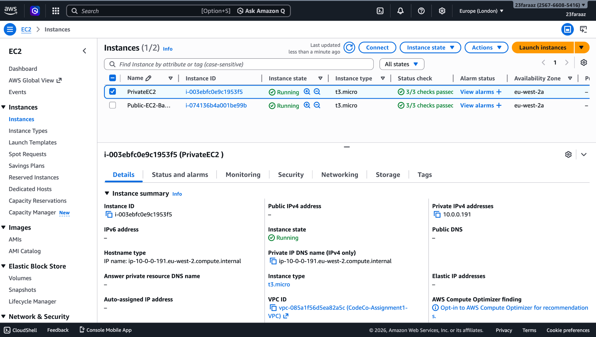
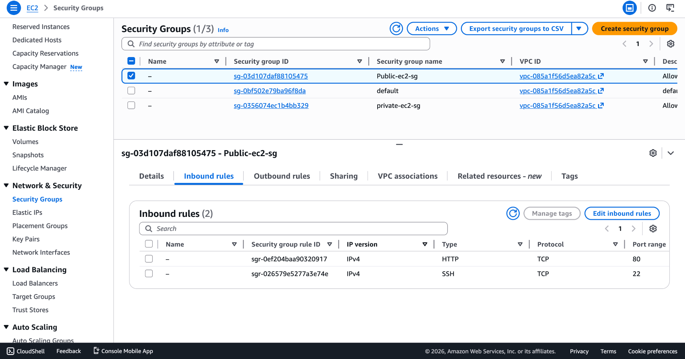
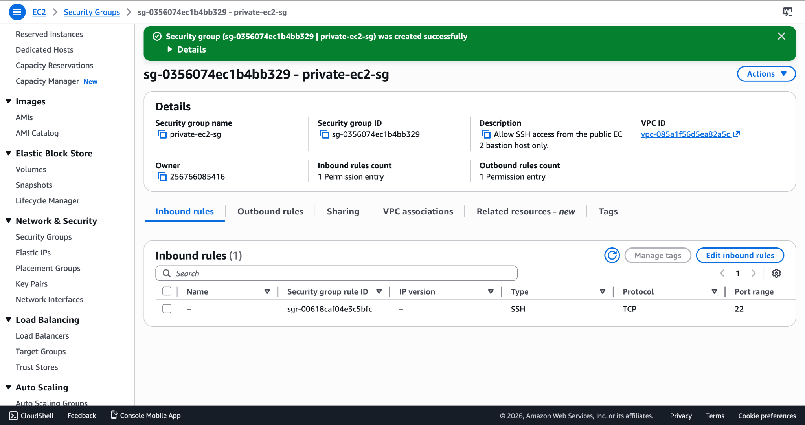
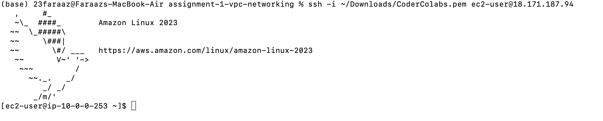
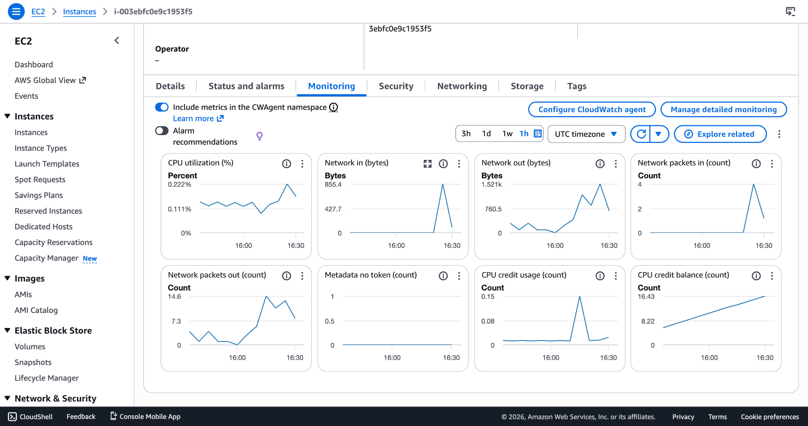

# AWS Bastion Host Architecture with Private EC2 & Monitoring

## Project Overview

This project demonstrates a secure AWS infrastructure architecture using a Bastion host to manage administrative access to private resources within a Virtual Private Cloud (VPC).

The goal of the project is to simulate a real-world production pattern where backend servers remain isolated from the public internet while administrators can securely manage infrastructure through a controlled entry point.

Key capabilities demonstrated in this project:

- Secure public and private network segmentation
- Controlled SSH access using a Bastion host
- Security group based access restrictions
- Infrastructure monitoring using Amazon CloudWatch
- Real-world troubleshooting of networking and SSH access issues

This architecture reflects a common pattern used in production cloud environments.

---

# Architecture

The infrastructure was deployed within a custom AWS VPC containing both public and private subnets.

Only the Bastion host is publicly accessible. All backend infrastructure remains isolated inside the private subnet.

```
                Internet
                    │
            ┌───────────────┐
            │ Internet GW   │
            └───────┬───────┘
                    │
          Route Table (Public)
                    │
             Public Subnet
             10.0.0.0/24
                    │
            Bastion Host EC2
             (Public IP)
                    │
               SSH Access
                    │
          Route Table (Private)
                    │
             Private Subnet
             10.0.1.0/24
                    │
             Private EC2 Instance
             (No Public IP)
```

---

# Network Configuration

| Component | CIDR |
|-----------|------|
| VPC | 10.0.0.0/16 |
| Public Subnet | 10.0.0.0/24 |
| Private Subnet | 10.0.1.0/24 |

The VPC provides network isolation and internal IP addressing for all resources.

Public and private subnets allow separation of externally accessible infrastructure from internal services.

---

# Routing Configuration

## Public Route Table

| Destination | Target |
|-------------|--------|
| 0.0.0.0/0 | Internet Gateway |

This route allows resources in the public subnet to communicate with the internet.

The Bastion host resides in this subnet.

---

## Private Route Table

The private subnet has no route to the Internet Gateway.

This ensures backend infrastructure cannot be accessed directly from the internet.

All administrative access must pass through the Bastion host.

---

# Infrastructure Components

## Bastion Host (Public EC2)

The Bastion host acts as a secure gateway for administrative access.

It is the only resource exposed to the public internet.

Responsibilities:

- Accept SSH connections from administrators
- Act as a jump server into the private subnet
- Reduce the attack surface of the infrastructure

### Bastion Security Group

| Type | Port | Source |
|-----|-----|-----|
| SSH | 22 | Administrator IP |

Restricting SSH access to a specific IP ensures only trusted machines can access the Bastion host.

---

## Private EC2 Instance

The private EC2 instance resides entirely within the private subnet.

Key characteristics:

- No public IP address
- Not reachable from the internet
- Accessible only through internal VPC networking

### Private EC2 Security Group

| Type | Port | Source |
|-----|-----|-----|
| SSH | 22 | Bastion Security Group |

This ensures the instance can only be accessed from the Bastion host.

---

# Secure SSH Access Flow

Administrative access follows a jump host pattern.

```
Laptop
   │
   ▼
Bastion Host (Public EC2)
   │
   │ SSH
   ▼
Private EC2 (10.0.0.191)
```

Example SSH command used:

```
ssh -i coderco.pem ec2-user@10.0.0.191
```

This confirms that the private instance is reachable only through internal VPC networking.

---

# Monitoring with CloudWatch

Amazon CloudWatch was enabled to monitor instance performance.

Metrics collected include:

- CPU Utilization
- Network In
- Network Out
- CPU Credit Usage

Detailed monitoring was enabled to provide higher resolution metrics.

To validate that monitoring was functioning correctly, CPU load was artificially generated using:

```
yes > /dev/null &
```

This created visible spikes in CPU utilization within the CloudWatch dashboard.

---

# Screenshots

## VPC Creation



---

## Subnets Created



---

## Internet Gateway Attached



---

## Public Route Table


---

## Private Route Table



---

## NAT Gateway



---

## EC2 Instances Running



---

## Bastion Security Group Configuration



---

## Private EC2 Security Group



---

## SSH Access to Bastion Host



---

## SSH Access to Private EC2 via Bastion


---

## CloudWatch Monitoring



---

# Challenges and Debugging

During the setup several infrastructure issues were encountered and resolved.

## Public IP Assignment Issue

Initial SSH attempts to the Bastion host failed.

Root cause:

The subnet configuration did not automatically assign public IPv4 addresses.

Resolution:

Enabled auto assign public IPv4 on the public subnet and restarted the instance.

---

## SSH Authentication Failure

SSH access from the Bastion host to the private EC2 instance initially failed.

Root cause:

The Bastion host did not have access to the required SSH private key.

Resolution:

Transferred the private key to the Bastion instance and set the correct permissions:

```
chmod 400 coderco.pem
```

---

# Security Principles Demonstrated

This architecture demonstrates several key cloud security practices.

## Network Segmentation

Separating infrastructure into public and private subnets limits exposure of backend services.

## Principle of Least Privilege

Private instances only allow traffic from trusted internal sources.

## Reduced Attack Surface

Only a single instance (the Bastion host) is publicly accessible.

## Controlled Administrative Access

All infrastructure access flows through a monitored entry point.

---

# Cost Considerations

To minimize operational cost the infrastructure was deployed using **t2.micro instances**, which fall within the AWS Free Tier.

This allows experimentation with cloud infrastructure without incurring unnecessary charges.

---

# Future Improvements

Potential improvements for production-grade deployments include:

- Replace Bastion hosts with AWS Systems Manager Session Manager
- Implement Infrastructure as Code using Terraform
- Introduce an Application Load Balancer
- Deploy Auto Scaling groups
- Add centralized logging and alerting

---

# Key Learning Outcomes

Through this project the following skills were demonstrated:

- AWS VPC networking design
- Public vs private subnet architecture
- Bastion host deployment
- SSH jump host access patterns
- Security group configuration
- CloudWatch monitoring
- Infrastructure troubleshooting

---

# Author

Faraaz Mohammed

DevOps / Cloud Engineering Portfolio Project