# AWS Application Load Balancer Architecture with Multi-AZ EC2 Deployment

## Project Overview

This project demonstrates how to deploy a **high-availability web architecture on AWS** using an **Application Load Balancer (ALB)** to distribute HTTP traffic across multiple EC2 instances deployed in different Availability Zones.

The goal of the project is to implement a production-style load balanced infrastructure pattern where traffic is routed through a load balancer before reaching backend compute resources.

Key capabilities demonstrated in this project:

- Load balanced application architecture
- Multi-Availability Zone deployment
- Target group health monitoring
- Security group based network isolation
- Verification of load distribution across backend servers

This architecture reflects a **common cloud design pattern used in scalable web infrastructure.**

---

# Architecture

The infrastructure consists of an internet-facing Application Load Balancer that distributes incoming requests to EC2 instances deployed across two availability zones.

```
                Internet
                    │
                    ▼
        Application Load Balancer
                    │
            ┌───────┴────────┐
            ▼                ▼
      EC2 Web Server     EC2 Web Server
        eu-west-2a          eu-west-2b
```

Incoming user traffic reaches the Application Load Balancer, which then distributes requests across multiple backend servers to ensure high availability.

---

# Infrastructure Components

## Application Load Balancer

The **Application Load Balancer (ALB)** acts as the entry point for incoming HTTP traffic.

Configuration details:

| Setting | Value |
|-------|------|
| Type | Application Load Balancer |
| Scheme | Internet-facing |
| Listener | HTTP : 80 |
| Routing | Forward to Target Group |

The load balancer distributes traffic between backend EC2 instances.

---

## EC2 Web Servers

Two EC2 instances were deployed to host a simple Apache web server.

| Setting | Value |
|------|------|
| Instance Type | t3.micro |
| OS | Amazon Linux |
| Web Server | Apache |
| Availability Zones | eu-west-2a, eu-west-2b |

Each server returns a unique response so that load balancing behaviour can be verified.

Example responses:

```
Hello from Web Server 1
Hello from Web Server 2
```

---

## Target Group

The **Target Group** registers backend instances and performs health checks.

Configuration:

| Setting | Value |
|------|------|
| Target Type | Instance |
| Protocol | HTTP |
| Port | 80 |
| Health Check Path | / |

Only healthy instances are eligible to receive traffic.

---

# Security Configuration

Security groups were used to control traffic flow between infrastructure components.

## ALB Security Group

Allows inbound HTTP traffic from the internet.

| Type | Port | Source |
|-----|-----|------|
| HTTP | 80 | 0.0.0.0/0 |

---

## EC2 Security Group

Allows inbound HTTP traffic **only from the Application Load Balancer**.

| Type | Port | Source |
|-----|-----|------|
| HTTP | 80 | ALB Security Group |

This ensures backend instances cannot be accessed directly from the internet.

---

# Deployment Steps

The infrastructure was deployed in the following order:

1. Launch two EC2 instances across different Availability Zones  
2. Install Apache using EC2 user-data scripts  
3. Create a Target Group and register both instances  
4. Configure health checks for backend services  
5. Deploy an internet-facing Application Load Balancer  
6. Configure HTTP listener on port 80  
7. Forward traffic to the target group  
8. Apply security group rules to restrict backend access

---

# EC2 User Data Script

Apache was installed automatically when launching the EC2 instances using the following user-data script.

```bash
#!/bin/bash
yum update -y
yum install -y httpd
systemctl start httpd
systemctl enable httpd
echo "Hello from Web Server 1" > /var/www/html/index.html
```

The second instance returns:

```
Hello from Web Server 2
```

---

# Load Balancing Verification

The DNS endpoint of the Application Load Balancer was accessed through a web browser.

Refreshing the page resulted in alternating responses from the backend servers, confirming that traffic was distributed correctly.

Example:

```
Hello from Web Server 1
Hello from Web Server 2
```

---

# Screenshots

## EC2 Instances Running

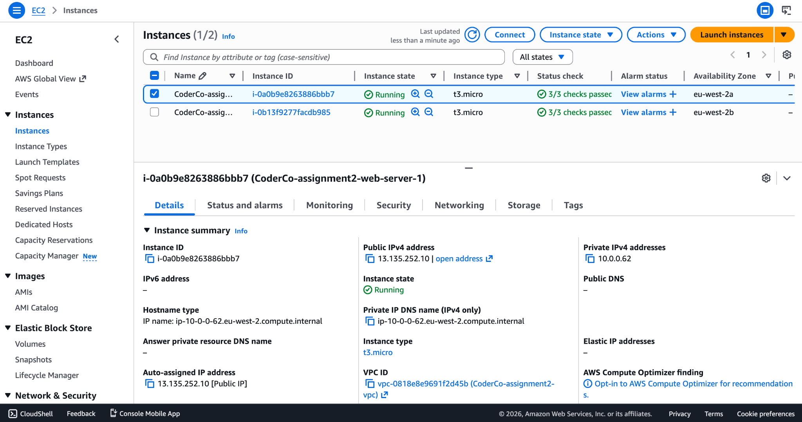

---

## EC2 Security Group Configuration

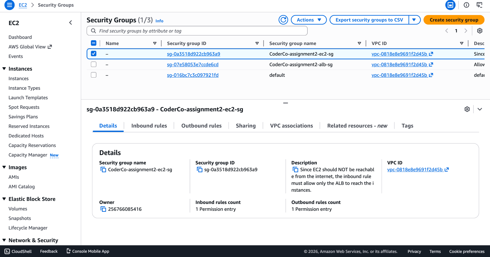

---

## ALB Security Group Configuration

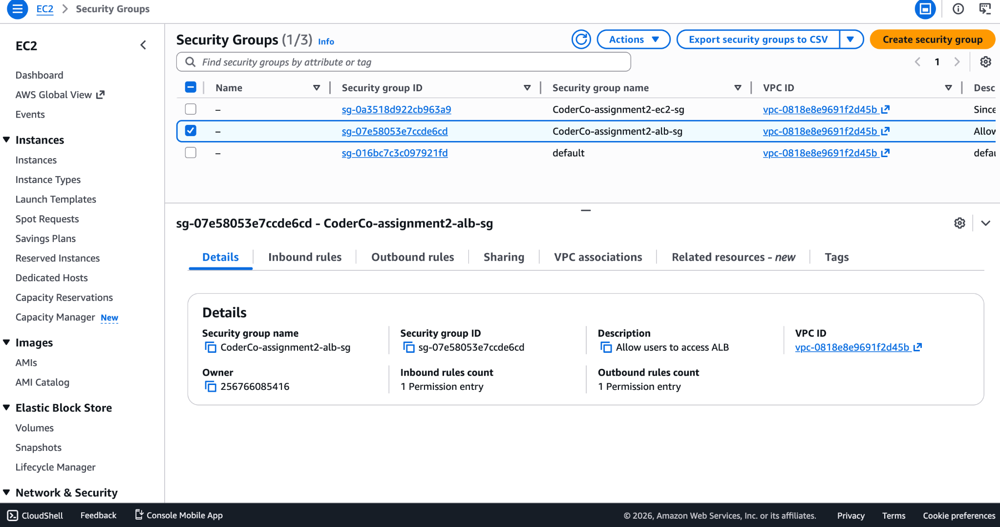

---

## Application Load Balancer Overview

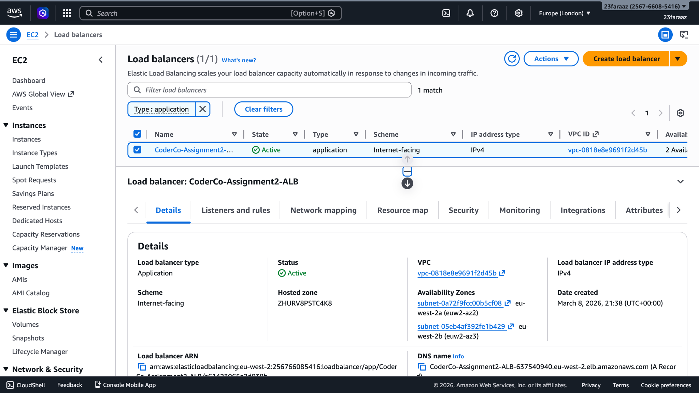

---

## ALB Listener Configuration

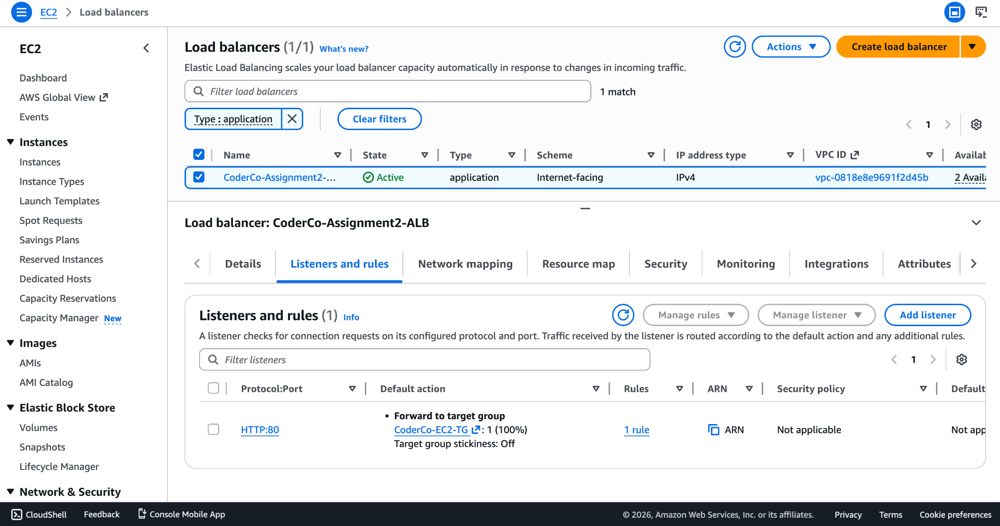

---

## Target Group Health Status

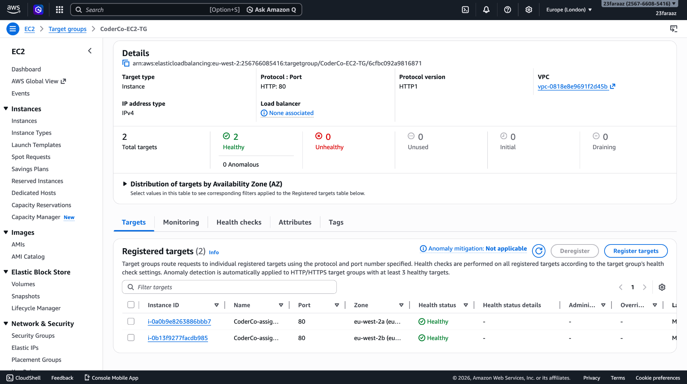

---

## Load Balancing Response – Web Server 1


---

## Load Balancing Response – Web Server 2


---

## Domain DNS Configuration

The domain was configured using Cloudflare DNS to point to the Application Load Balancer endpoint.

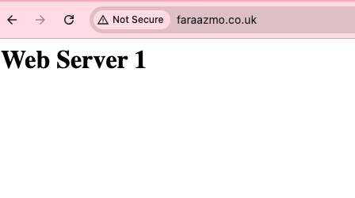

---

## Domain Access Test

The application was accessed using the configured domain name.  
The request successfully reached the load balancer and was routed to one of the backend servers.

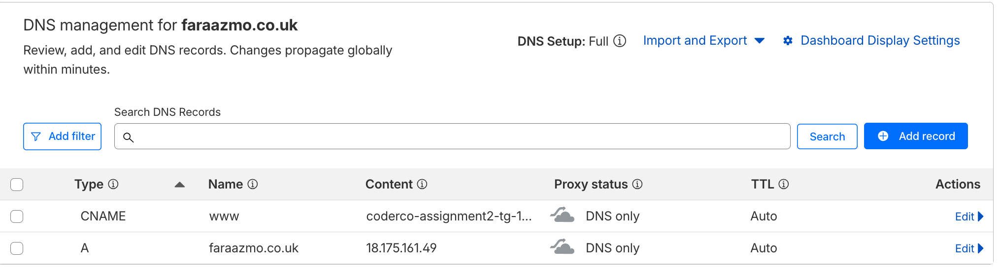

---

# High Availability Resilience Test (Bonus Challenge)

To simulate a real-world infrastructure failure scenario, one backend EC2 instance was intentionally stopped to observe how the Application Load Balancer reacts to instance failure.

This test validates that the architecture can maintain service availability even when part of the infrastructure becomes unavailable.

---

## Test Procedure

1. Access the application using the Application Load Balancer DNS endpoint  
2. Confirm that both backend servers respond correctly  
3. Manually stop one EC2 instance (`web-server-1`)  
4. Observe how the Target Group health checks detect the failure  
5. Refresh the application endpoint to confirm traffic is rerouted  

---

## Instance Failure Simulation

One EC2 instance was stopped to simulate a backend server failure.

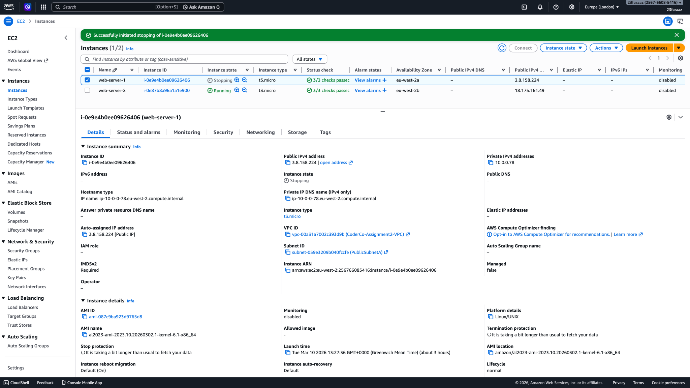

---

## Target Group Health After Failure

The Target Group automatically detected that the instance was no longer healthy and removed it from the pool of available targets.

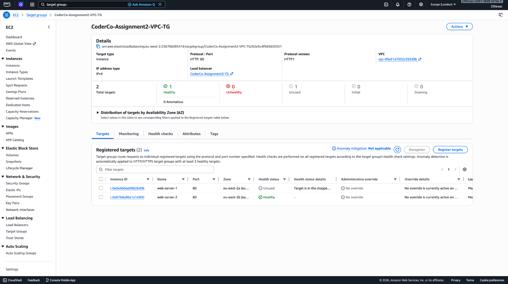

---

## Traffic Successfully Routed to Healthy Instance

Despite one backend server being unavailable, the application remained accessible and all traffic was automatically routed to the remaining healthy instance.

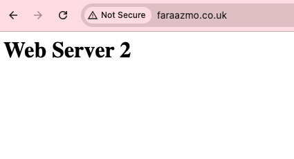

---

## Result

This test confirms the resilience of the architecture:

- Application Load Balancer health checks detect failed instances
- Unhealthy instances are automatically removed from the routing pool
- Traffic continues to be served by healthy instances
- The system maintains availability without manual intervention

This behaviour demonstrates a fundamental **high availability pattern used in production cloud architectures.**

---
# Challenges and Debugging

## Health Check Verification

Target group health checks initially needed verification to ensure Apache was running correctly on both instances.

Resolution:

Confirmed Apache installation via EC2 user-data scripts and verified health checks using the target group dashboard.

---

# Security Principles Demonstrated

This architecture demonstrates several important cloud security practices.

## Layered Infrastructure Design

Traffic must pass through the Application Load Balancer before reaching backend servers.

## Network Isolation

Backend EC2 instances cannot be accessed directly from the internet.

## Controlled Access

Only the load balancer can communicate with the backend servers.

---

# Cost Considerations

The infrastructure uses **t3.micro EC2 instances**, which fall within the AWS Free Tier.

This allows experimentation with load balancing architectures while minimizing cost.

---

# Future Improvements

Potential improvements for production-grade deployments include:

- Implement HTTPS using AWS Certificate Manager
- Add Auto Scaling groups for dynamic scaling
- Deploy infrastructure using Terraform
- Introduce monitoring and alerting with CloudWatch Alarms
- Add a Web Application Firewall (WAF)

---

## Key Learning Outcomes

Through this project the following skills were demonstrated:

- Application Load Balancer configuration
- Target group health monitoring
- Multi-Availability Zone architecture
- Security group network isolation
- Load balancing verification
- Cloud infrastructure troubleshooting

## Technology Stack

- AWS EC2  
- AWS Application Load Balancer (ALB)  
- AWS VPC  
- AWS Subnets  
- AWS Route Tables  
- AWS Internet Gateway  
- AWS Security Groups  
- AWS Auto Scaling (optional if implemented)  
- AWS Route53 (optional DNS)  
- Linux (Amazon Linux)  
- NGINX Web Server  
- Bash (EC2 User Data)  

---

# Author

Faraaz Mohammed

DevOps / Cloud Engineering Portfolio Project