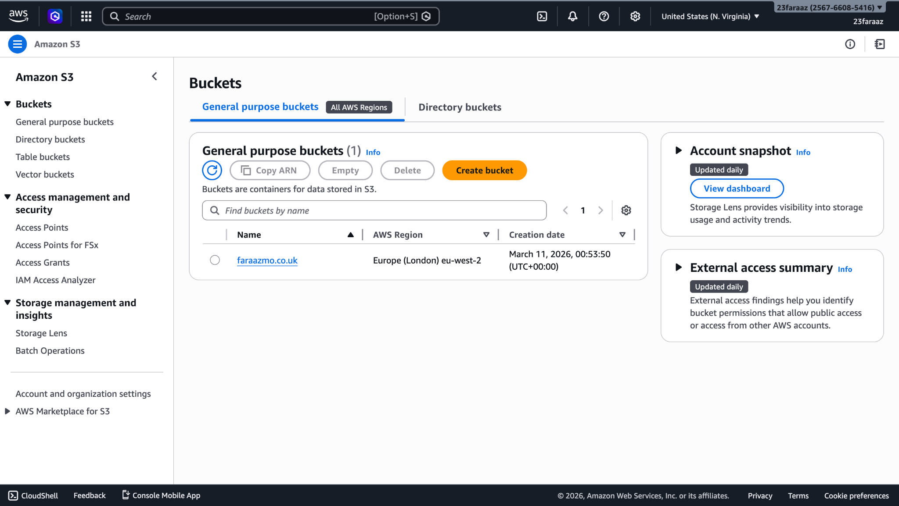
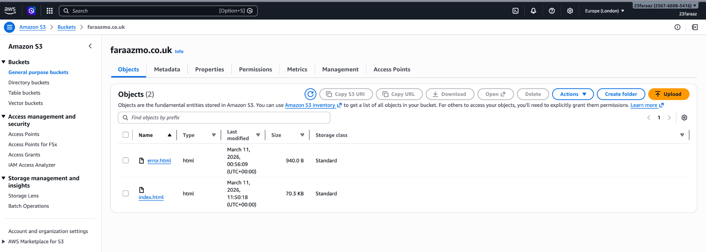
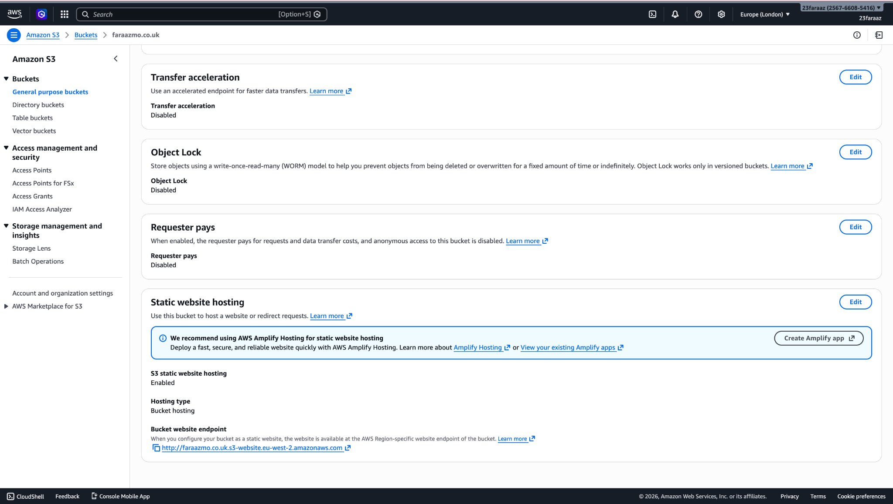
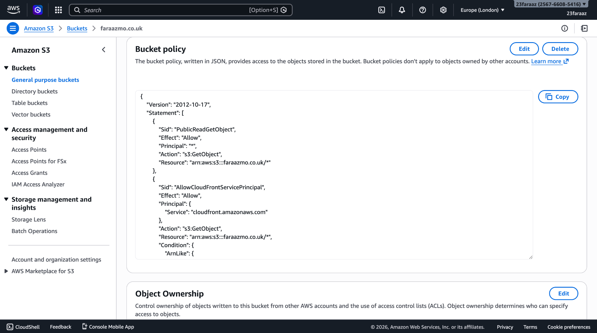
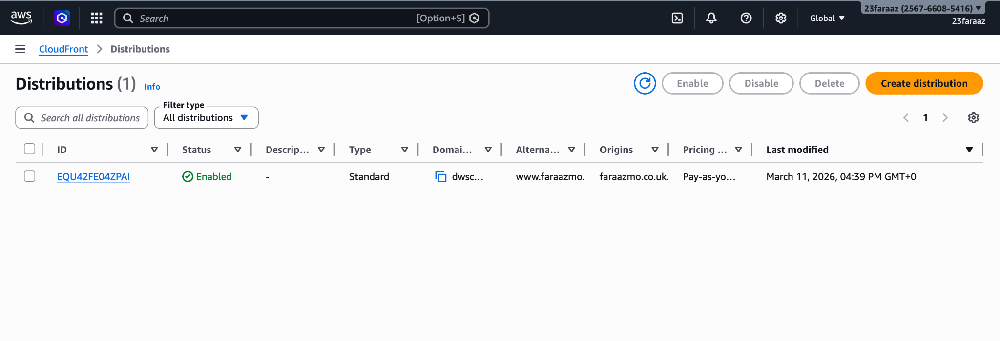
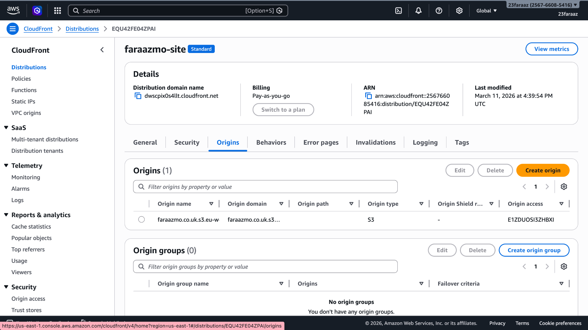
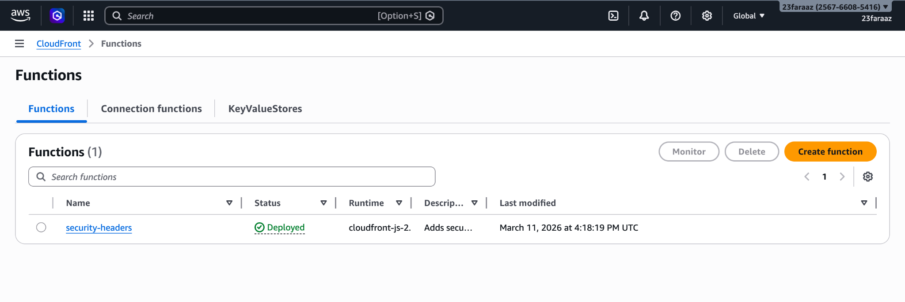
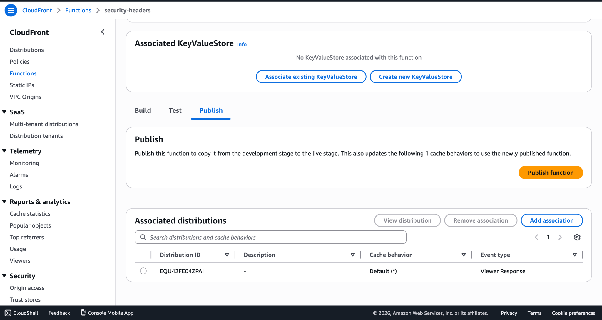
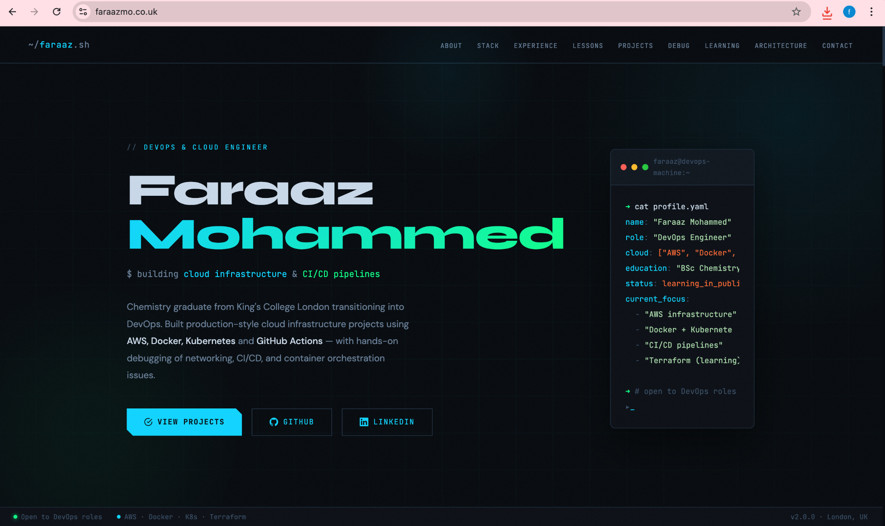

# AWS Static Website Platform with CloudFront CDN, Edge Security, and CI/CD Deployment

This repository contains the implementation of a production-style static website delivery platform built on AWS. The system combines origin storage, global CDN distribution, edge security controls, and automated deployment to simulate the architecture used by modern web platforms serving static applications at scale.

The platform uses Amazon S3 as the origin storage layer, CloudFront as a global content delivery network, and GitHub Actions to implement a continuous deployment pipeline. The objective was to design a deployment model where application updates are version controlled, automatically deployed, and delivered globally with consistent security policies applied at the edge.

Key capabilities demonstrated in this implementation include global CDN delivery, automated CI/CD deployment, DNS routing, edge security enforcement, and infrastructure troubleshooting in a cloud environment.

---

## System Architecture

The infrastructure follows the common pattern used by modern static application platforms.

```
                Internet
                    │
                    ▼
                Route53 DNS
                    │
                    ▼
              CloudFront CDN
      (HTTPS termination + edge caching)
                    │
                    ▼
        CloudFront Edge Security Function
          (HTTP security headers injection)
                    │
                    ▼
            S3 Static Website Origin
         (HTML / CSS / JS application files)
```

User requests are resolved through DNS and routed to the nearest CloudFront edge location. The CDN handles TLS termination, caching, and response modification before retrieving content from the S3 origin if necessary.

This architecture significantly reduces latency for global users while protecting the origin infrastructure.

---

## CI/CD Deployment Architecture

The deployment pipeline automates application delivery.

```
Developer pushes code
        │
        ▼
GitHub Repository
        │
        ▼
GitHub Actions CI/CD Pipeline
        │
        ├── Authenticate to AWS
        ├── Upload website files to S3
        └── Invalidate CloudFront cache
                │
                ▼
Updated site delivered globally
```

Once the pipeline is configured, deployments require only a Git push. The infrastructure handles the remainder of the release process automatically.

---

## Infrastructure Components

### Amazon S3 — Static Website Origin

The application is hosted as a static website inside an S3 bucket configured for public read access and static hosting.

Configuration:

| Setting | Value |
|------|------|
| Bucket Name | faraazmo.co.uk |
| Hosting Mode | Static Website |
| Files | index.html, error.html |
| Access Policy | Public read |

The S3 bucket acts as the origin storage layer for the CloudFront distribution.

Screenshot:



Uploaded website files:



Static hosting enabled:



Public bucket policy:



---

### CloudFront — Global CDN Layer

CloudFront sits in front of the S3 bucket to provide:

* HTTPS termination
* global edge caching
* improved latency
* origin protection
* response transformation

Distribution configuration:

| Setting | Value |
|------|------|
| Distribution Type | Standard |
| Origin | S3 website endpoint |
| Viewer Protocol | HTTPS |
| Cache Policy | Managed-CachingOptimized |

Screenshot:



Origin configuration:



---

### Edge Security Layer — CloudFront Functions

A CloudFront Function is deployed to inject HTTP security headers at the edge.

This approach enforces browser security policies without modifying application code.

Headers implemented include:

```
Strict-Transport-Security
X-Frame-Options
X-Content-Type-Options
Content-Security-Policy
```

Screenshot:



Function attached to distribution behaviour:



---

### Domain Routing

The custom domain resolves to the CloudFront distribution via DNS.

Users access the site through the domain while traffic is delivered through the CDN edge network.

Screenshot:



---

## CI/CD Deployment Pipeline

Deployment automation is implemented using GitHub Actions.

Pipeline responsibilities:

1. Checkout repository
2. Authenticate with AWS using secure secrets
3. Synchronise website files to the S3 bucket
4. Invalidate CloudFront cache to propagate updates

Screenshot:


---

### Deployment Commands Used

The CI/CD workflow executes AWS CLI commands.

S3 deployment:

```bash
aws s3 sync assignment-3-s3/ s3://faraazmo.co.uk --delete
```

CloudFront cache invalidation:

```bash
aws cloudfront create-invalidation \
--distribution-id EQU42FE04ZPAI \
--paths "/*"
```

This ensures that updates are visible immediately across the CDN.

---
## IAM Security Model for CI/CD Deployment

The CI/CD pipeline authenticates with AWS using an **IAM user rather than the root account**.

This follows AWS security best practices, where the **root account is reserved only for account-level administration** and should never be used for automation or programmatic access.

Instead, a dedicated IAM user (`github-deploy`) was created specifically for the deployment pipeline.

### Credential Flow Architecture

Developer push
│
▼
GitHub Actions Runner
│
▼
GitHub Secrets
(AWS_ACCESS_KEY_ID + AWS_SECRET_ACCESS_KEY)
│
▼
IAM Deploy User
│
▼
AWS API (S3 + CloudFront)


### IAM Permissions

The IAM user was granted the following managed policies:

- AmazonS3FullAccess
- CloudFrontFullAccess


These permissions allow the pipeline to:

- Upload website assets to the **S3 origin bucket**
- Trigger **CloudFront cache invalidations**
- Deploy updates automatically without manual console interaction

### Security Benefits

Using IAM credentials instead of the root account provides several security advantages:

- Limits the **blast radius** if credentials are compromised  
- Enables **policy-based permission control**  
- Allows **credential rotation** without affecting the root account  
- Aligns with **AWS least-privilege security practices**

This approach reflects how CI/CD pipelines authenticate with cloud infrastructure in production environments.

---

## Operational Deployment Workflow

```
git commit
git push
      │
      ▼
GitHub Actions Pipeline
      │
      ▼
S3 Content Sync
      │
      ▼
CloudFront Cache Invalidation
      │
      ▼
Global CDN Update
```

No manual interaction with the AWS console is required once the pipeline is configured.

---

## Performance and Reliability Characteristics

This architecture provides several operational benefits.

Global performance is improved because content is cached at CloudFront edge locations.

Origin protection is achieved by routing traffic through the CDN rather than directly exposing S3.

Deployment reliability improves because releases are automated through CI/CD pipelines.

Security enforcement occurs consistently through the edge security layer.

---

## Debugging and Operational Experience

Several issues were encountered and resolved while building this system.

### CloudFront Function Association Failure

Initial attempts to attach the function produced an error:

```
FunctionAssociationArn invalid
```

Cause: the function had not been published to the LIVE stage.

Resolution: publish the function before associating it with the distribution behaviour.

---

### CDN Cache Staleness

After updating the website, changes were not immediately visible.

Cause: CloudFront cached the previous response.

Resolution: implement automated cache invalidation as part of the CI/CD pipeline.

---

### CI/CD Pipeline Not Triggering

The pipeline initially failed to execute.

Cause: the workflow file was incorrectly placed in a project subfolder.

Resolution: move the workflow file to the required location:

```
.github/workflows/deploy.yml
```

This allowed GitHub Actions to detect and run the pipeline.

---

## Engineering Lessons

Several practical lessons emerged from implementing this system.

CDN caching significantly improves performance but introduces cache consistency challenges. Automating invalidation is essential for reliable deployments.

Edge functions provide a lightweight and powerful mechanism for enforcing platform-wide security policies.

CI/CD pipelines reduce operational risk by ensuring deployments are reproducible and version controlled.

Cloud architectures must integrate infrastructure, security, and deployment automation together to operate reliably.

---

## DevOps Capabilities Demonstrated

This project demonstrates practical experience with:

* CDN architecture
* static application hosting
* edge security enforcement
* CI/CD pipeline design
* automated deployments
* DNS routing
* cloud infrastructure debugging

## Technology Stack

AWS S3  
AWS CloudFront  
AWS Route53  
AWS IAM  
CloudFront Functions  
GitHub Actions  
AWS CLI

---

Author  
Faraaz Mohammed  
DevOps & Cloud Infrastructure Engineering Portfolio