# AWS Serverless API Platform with API Gateway, Lambda, DynamoDB, Edge Security, and Custom Domain Routing

This repository contains the implementation of a production-style serverless API platform built on AWS. The system combines managed API routing, event-driven compute, NoSQL persistence, edge security controls, access management, and observability to simulate the architecture used by modern cloud-native backend services.

The platform uses Amazon API Gateway as the managed API layer, AWS Lambda as the serverless compute layer, and Amazon DynamoDB as the persistence layer. The objective was to design a route-based API model where requests are securely exposed through a custom domain, processed by dedicated Lambda functions, stored in DynamoDB, and monitored through CloudWatch.

Key capabilities demonstrated in this implementation include serverless API design, route-based request handling, custom domain integration, WAF-based edge security, API key access control, IAM least-privilege configuration, and operational observability.

---

## System Architecture

```text
                    Internet User
                          │
                          ▼
                 Cloudflare DNS / CDN
                          │
                          ▼
                      AWS WAF
            (rate limiting + IP filtering)
                          │
                          ▼
                   Amazon API Gateway
             (REST API + API key enforcement)
                          │
              ┌───────────┴───────────┐
              ▼                       ▼
    AWS Lambda - Write Route    AWS Lambda - Read Route
        (POST /submit)             (GET /students)
              │                       │
              └───────────┬───────────┘
                          ▼
                Amazon DynamoDB Table
                       (students)
                          │
                          ▼
           Amazon CloudWatch Logs / Metrics
```

---

## Infrastructure Components

### Amazon API Gateway

| Setting | Value |
|--------|------|
| API Type | REST API |
| Stage | prod |
| Routes | POST /submit, GET /students |
| Integration | Lambda Proxy |
| Access Control | API Key Required |
| CORS | Enabled |

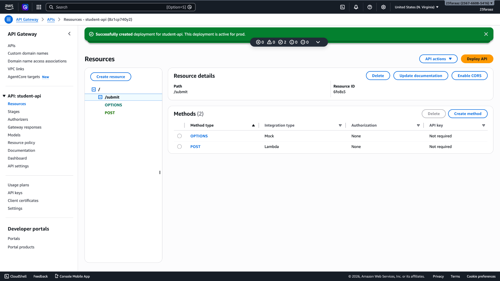
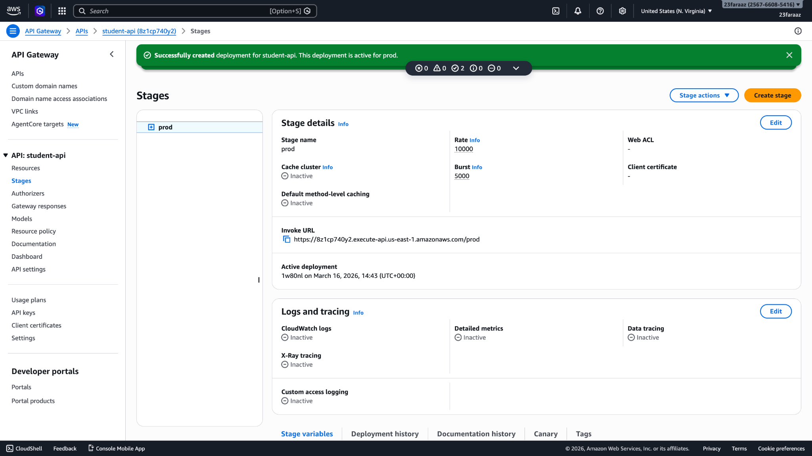

---

### AWS Lambda

#### Write Function (POST /submit)

- Generate UUID  
- Validate input  
- Add timestamp  
- Store item in DynamoDB  
- Return structured response  

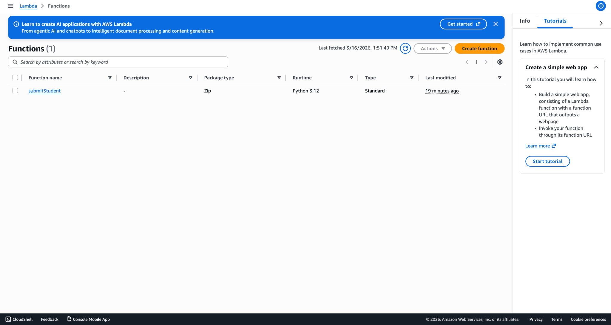
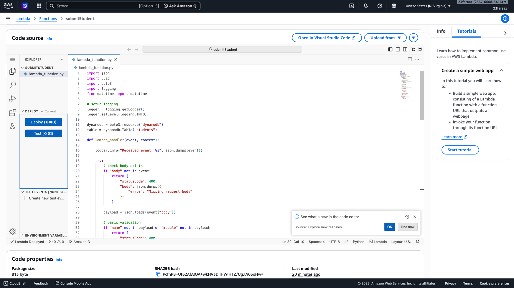

---

#### Read Function (GET /students)

- Scan DynamoDB table  
- Return list of students  

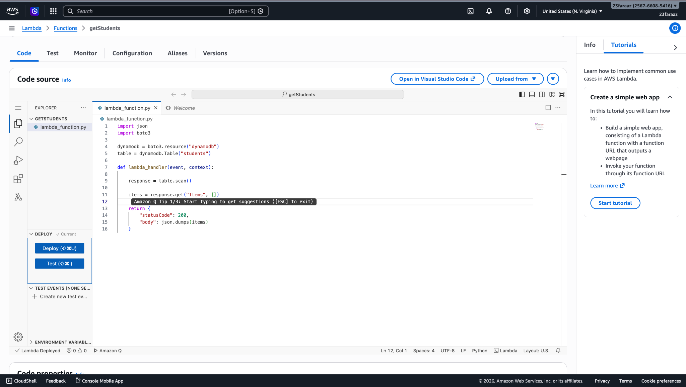

---

### Amazon DynamoDB

| Setting | Value |
|--------|------|
| Table Name | students |
| Partition Key | id |
| Billing Mode | On-Demand |

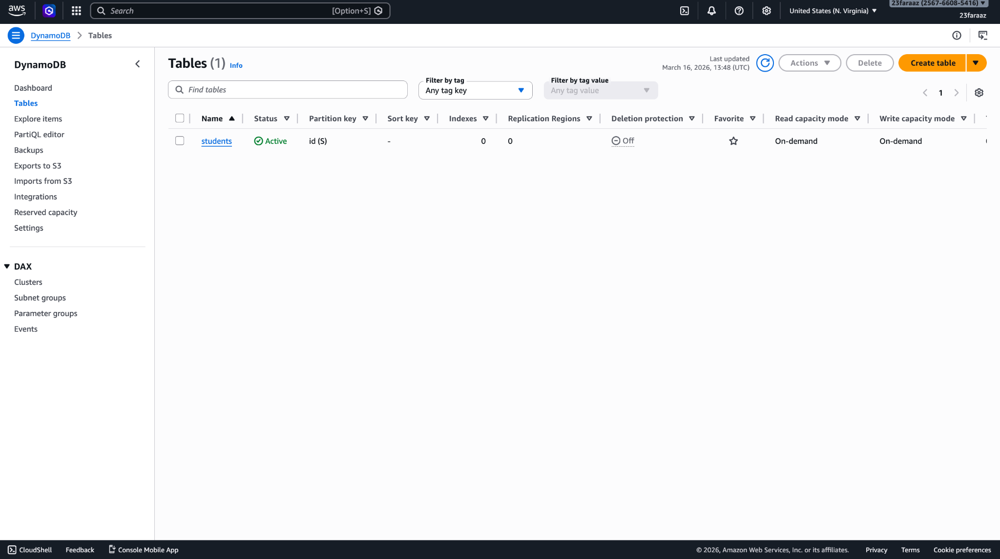
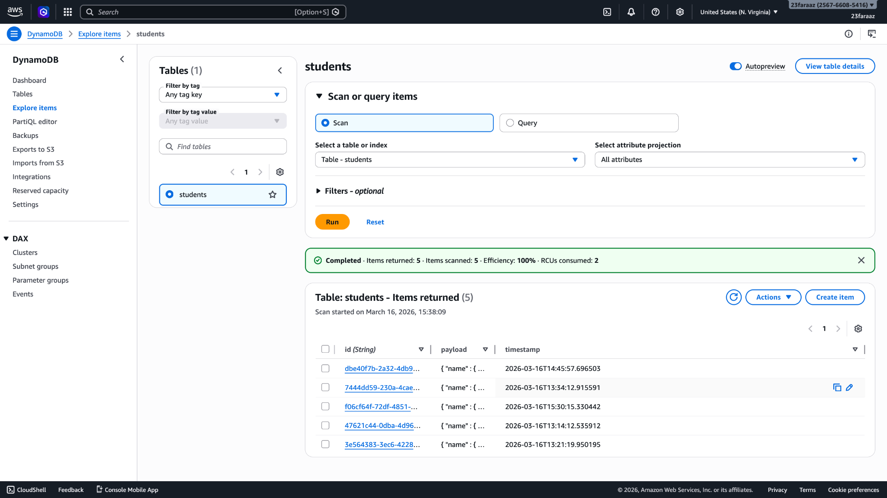

---

### Security (WAF + API Keys)

AWS WAF is used to provide an additional security layer at the edge by applying rate limiting and request filtering before traffic reaches API Gateway.

API Gateway enforces access control through API keys and usage plans, allowing requests to be authenticated and throttled based on defined limits.

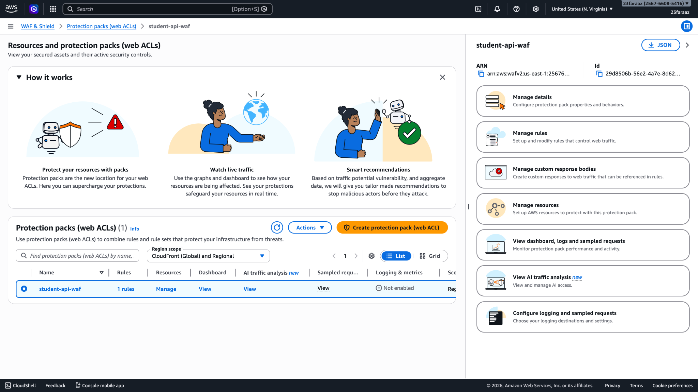
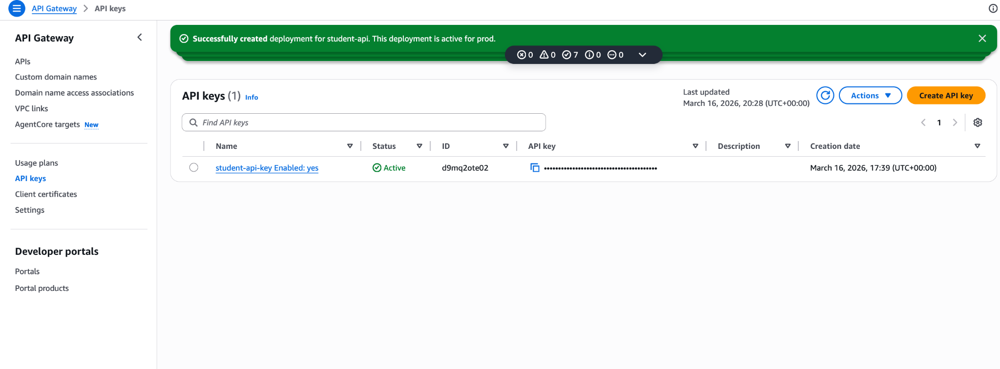

---

### Custom Domain

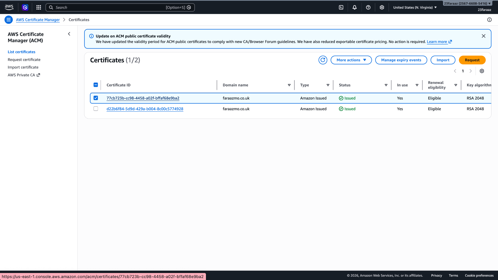
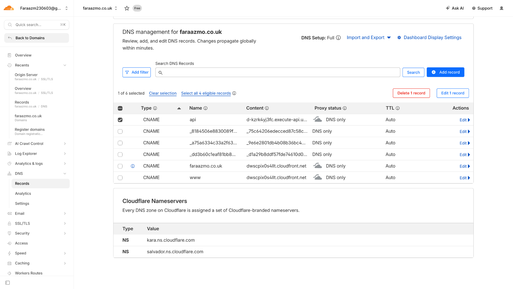
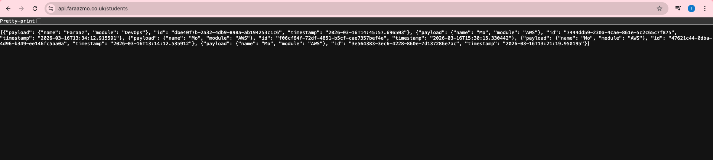

---

### Observability

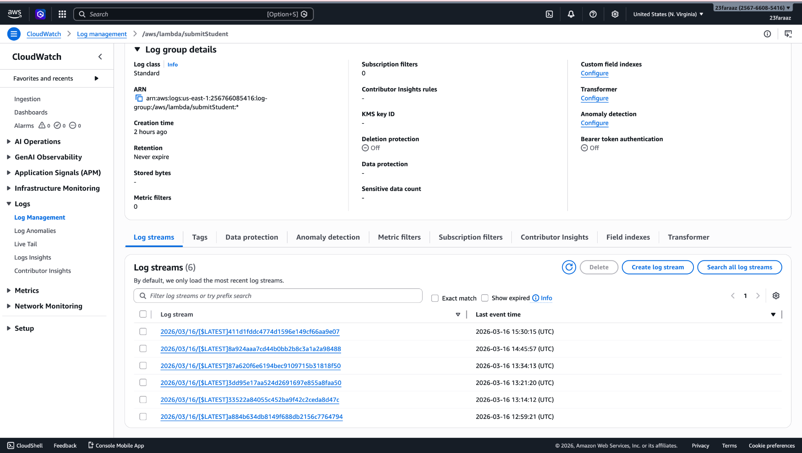

---

## API Testing

```bash
curl -X POST https://api.faraazmo.co.uk/submit \
  -H "Content-Type: application/json" \
  -H "x-api-key: YOUR_API_KEY" \
  -d '{"name":"Mo","module":"AWS"}'
```

```bash
curl -X GET https://api.faraazmo.co.uk/students   -H "x-api-key: YOUR_API_KEY"
```
---

## Design Decisions

- Route-based Lambda separation improves clarity and maintainability  
- DynamoDB on-demand avoids capacity planning while supporting scaling  
- WAF provides an additional security layer before API Gateway  
- API keys introduce controlled access and rate limiting  
- CloudWatch enables observability for debugging and monitoring  

---

## Debugging

- IAM permission issues (fixed with DynamoDB access)
- Scan logic errors in Lambda
- CORS configuration issues
- API key enforcement errors
- WAF tuning
- DNS misconfiguration

---

## Tech Stack

AWS API Gateway  
AWS Lambda  
Amazon DynamoDB  
AWS IAM  
Amazon CloudWatch  
AWS WAF  
AWS Certificate Manager  
Cloudflare  

---

Author  
Faraaz Mohammed  
DevOps & Cloud Infrastructure Engineering Portfolio